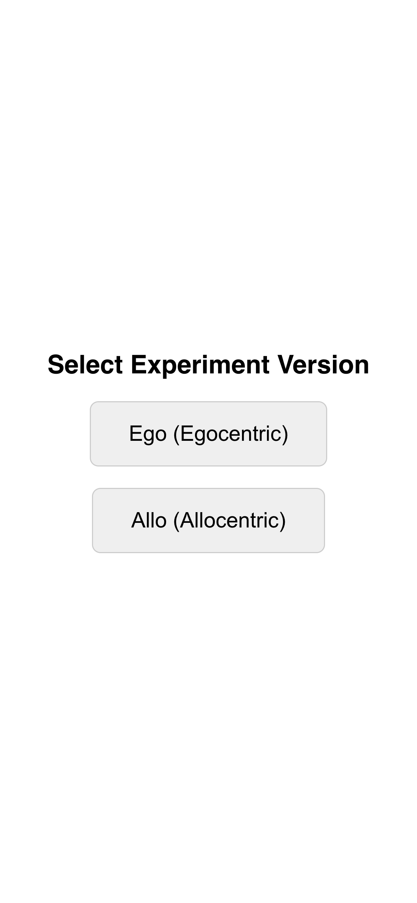
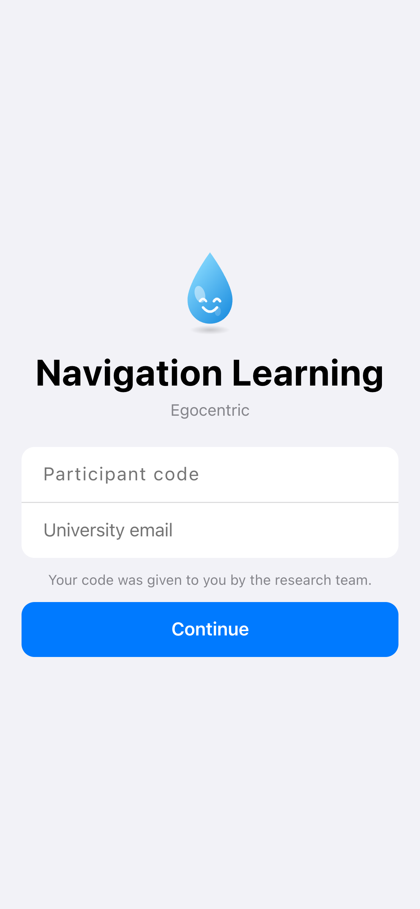
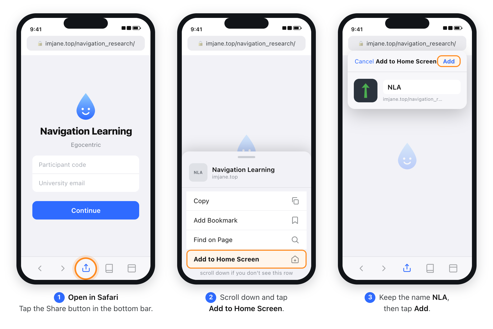
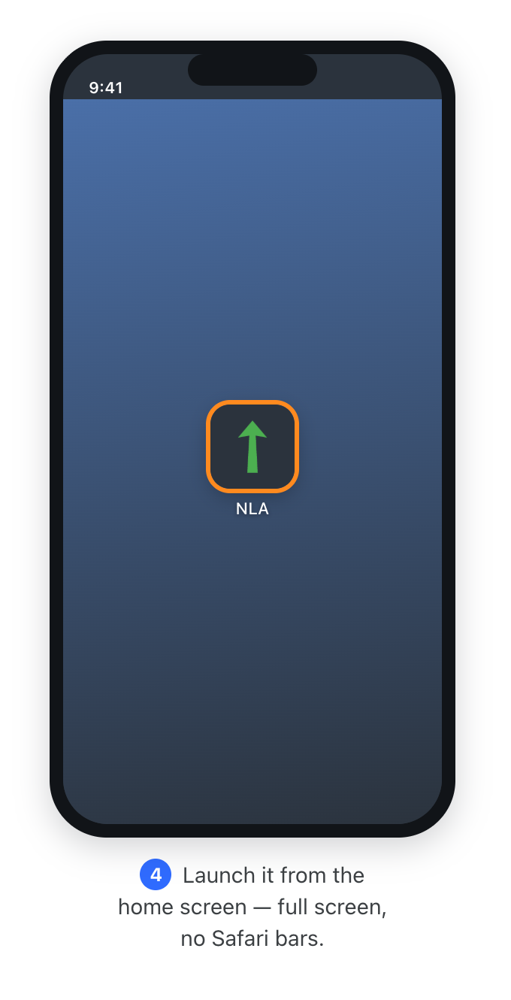
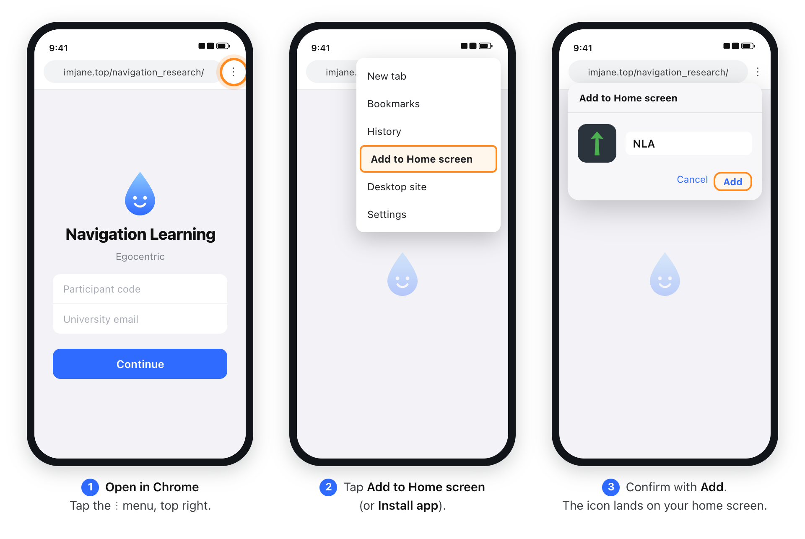

# NLA — Navigation Learning

A spatial-navigation experiment platform. Participants run short AR trials on their
phone: a cube and a sphere are anchored to real-world compass bearings through the
camera, and each trial asks where one object is relative to the other. Two conditions
are implemented — **egocentric** (relative to your own facing) and **allocentric**
(relative to a fixed external frame).

**Live platform → [https://imjane.top/navigation_research/](https://imjane.top/navigation_research/)**

Built with React 19 + Vite, deployed as an installable PWA on GitHub Pages, with
Supabase for structured data storage.

---

## For participants

### 1. Open it on your phone

The experiment **only works on a phone.** It uses the rear camera and the compass,
and neither is available on a laptop — on a desktop browser the app falls back to a
keyboard simulation meant for developers, and your data will not be usable.

Open this address on your phone:

```
https://imjane.top/navigation_research/
```

> **Use the phone's real browser — Safari on iPhone, Chrome on Android.**
> Do not open it from inside WeChat, Instagram, Messages, or any other app's built-in
> browser. Those in-app browsers block camera and motion access and cannot install the
> app to your home screen.

This is what you should see when it loads:

<p align="center">
  
  &nbsp;&nbsp;&nbsp;
  
</p>

Pick the version the research team told you to use, then sign in with **the participant
code you were given** and **your university (.edu) email**.

### 2. Add it to your home screen

Please install it before your first session. It is not optional housekeeping — it
changes how the experiment behaves:

- **The browser bars disappear.** In a normal tab, Safari's address bar slides in and
  out as you move the phone, which resizes the AR view mid-trial and shifts where the
  objects appear.
- **Daily reminders only work once installed.** On iOS, a web page in a Safari tab can
  never receive a notification. Only a home-screen app can.
- **It opens like a real app** — one tap, straight into the experiment.

#### iPhone / iPad (Safari)



1. Open the link **in Safari** and tap the **Share** button in the bottom bar.
2. Scroll down the share sheet and tap **Add to Home Screen**. (It sits below Copy,
   Add Bookmark and Find on Page — you usually have to scroll.)
3. Leave the name as **NLA** and tap **Add** in the top-right corner.

<p align="center">
  
</p>

From now on, start the experiment from the **NLA** icon on your home screen — not from
Safari.

#### Android (Chrome)



1. Open the link **in Chrome** and tap the **⋮** menu in the top-right corner.
2. Tap **Add to Home screen** (some versions of Chrome call it **Install app**).
3. Confirm with **Add**. The **NLA** icon appears on your home screen.

### 3. Allow camera and motion access

The first time you start a block, the phone asks for two permissions. Both are
required — the experiment cannot run without either:

| Prompt | Why it is needed |
| --- | --- |
| **Camera** | The trial objects are drawn over the live camera view. |
| **Motion & Orientation** | The compass anchors those objects to real-world bearings, so they stay put when you turn. |

If you tapped "Don't Allow" by accident, you can re-enable them in
**Settings → Safari → Camera / Motion & Orientation Access** on iOS, or by tapping the
lock icon next to the address bar on Android.

### 4. How to hold the phone

Hold the phone **upright, filming straight ahead**, with your elbow at roughly 90° —
the same posture as taking a photo of something in front of you. Do not point the
camera at the ground. Each block starts with an alignment step: two arrows share one
root in the middle of the screen, and you turn your body until the green one lines up
with the dark one.

---

## For researchers

The admin dashboard is deliberately unlinked from the participant UI so nobody walks
into it mid-experiment. Reach it with a query parameter:

```
https://imjane.top/navigation_research/?view=dashboard
```

It has a **Supabase** tab (all participants) and a **This device** tab (whatever this
phone recorded locally), plus CSV export. Test runs should use the participant code
`TEST-LOCAL`.

**Before every data-collection session, check that the backend is actually reachable:**

```bash
npm run check:db
```

The app writes to `localStorage` as well as Supabase, so a dead backend does not look
like an error during a trial — it just silently collects nothing remotely. A red banner
appears on every experiment screen when remote writes are failing, and `check:db` names
the most common cause (a free-tier Supabase project paused after a week idle).

---

## Development

```bash
npm install
npm run dev          # http://localhost:5173
npm run lint         # keep this at 0 problems
npm run build
npm run preview
```

Copy `.env.example` to `.env` (gitignored) and fill in the Supabase URL and anon key
before running — without them the app still runs, but stores data only on the device.
The VAPID keys in the same file are only needed if you are working on push reminders.

Testing on a real phone needs HTTPS, because the camera and compass APIs are not
available on a plain-HTTP origin. Tunnel the dev server:

```bash
npx cloudflared tunnel --url http://127.0.0.1:5173
```

Use `127.0.0.1`, not `localhost` — cloudflared resolves `localhost` to IPv6 `::1`,
which Vite refuses.

### Deploying

```bash
npm run deploy
```

This builds with `.env` baked in and force-pushes `dist/` to the `gh-pages` branch,
which is what GitHub Pages serves at the live URL. Pushing to `3d-version` does **not**
deploy — only `npm run deploy` does.

Vite's `base` is `/navigation_research/`, so any static asset referenced from JavaScript
must go through `import.meta.env.BASE_URL`, never a bare `/foo.png`.

### Layout

```
src/
├── App.jsx                 # condition selector + dashboard route
├── nla-ego-version.jsx     # egocentric: question, answer key, state machine
├── nla-allo-version.jsx    # allocentric: same, different frame of reference
├── ARStage.jsx             # camera + world-anchored 3D objects
├── RemoteStatus.jsx        # red banner when remote writes fail
├── ReminderSetup.jsx       # push-notification opt-in
├── dashboard.jsx           # researcher view (?view=dashboard)
├── ui/                     # shared interface: theme tokens, kit, screens, trial
└── lib/                    # supabase, db, dbHealth, localStore, profile, push
supabase/
├── schema.sql              # participants → sessions → orientation_blocks → trials
├── push_schema.sql         # push_subscriptions
├── cron.sql                # reminder schedule
└── functions/send-reminders/
scripts/check-db.mjs        # backend reachability check
```

Both version files hold only the question, the answer key and the state machine —
every screen they render lives in `src/ui/`. Keep it that way; they used to carry
identical copies of every screen and ran well over a thousand lines each.

`src/lib/appVersion.js` stamps `APP_VERSION` onto every trial row. Bump it whenever a
presentation change could move accuracy or reaction time, so analyses can separate the
versions.

---

## Branches

`3d-version` is the default branch and the one to work on. `main` is a dormant
historical branch kept at the same commit. `gh-pages` holds the built site and is
overwritten by `npm run deploy` — never edit it by hand.
